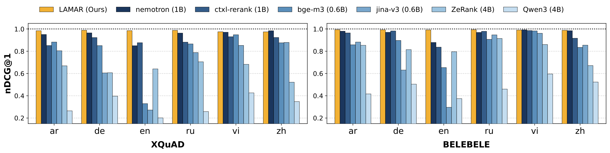

# LAMAR: Language-Aware Multilingual Alignment Reranker

LAMAR is a 600m-parameter multilingual cross-encoder reranker designed for **language-aware multilingual retrieval**. It jointly considers **semantic relevance** and **language coherence**, producing rankings that preserve topical relevance while accounting for language consistency between the query and the retrieved document.

**Paper:** [LAMAR: An Open Language-Aware Multilingual Alignment Reranker](https://arxiv.org/abs/2607.22042)

## Highlights

- **Language-aware reranking:** Jointly optimizes semantic relevance and query-document language coherence.
- **Multilingual coverage:** Trained on 51 languages and evaluated on 31 languages.
- **Strong language-coherence performance:** Achieves the best performance among the compared models on a language-coherence evaluation using oracle subsets from multilingual parallel datasets.
- **General multilingual reranking:** Delivers competitive performance across MIRACL, XGLUE, HUME, MLDR, and Wikipedia reranking benchmarks.

LAMAR is initialized from `BAAI/bge-m3-retromae` and trained in two stages. The first stage performs English-anchored multilingual relevance alignment using relevance scores from `Qwen/Qwen3-Reranker-4B`. The second stage applies language-coherence training to account for consistency between the query and document languages.

The figure below shows nDCG@1 for the six languages shared by XQuAD and BELEBELE: `ar`, `de`, `en`, `ru`, `vi`, and `zh`.



The XQuAD and BELEBELE evaluation subsets consist of parallel gold documents in 12 and 14 languages, respectively. For each query, we evaluate whether the document written in the same language as the query is ranked first. The full language lists and results across all languages are reported in the [**Language-Coherence Evaluation**](#language-coherence-evaluation) section below.

## Model Overview

| Property | Value |
|---|---|
| Base model | [`BAAI/bge-m3-retromae`](https://huggingface.co/BAAI/bge-m3-retromae) |
| Parameters | 600m |
| Maximum input length | 8,192 tokens |
| Training languages | 51 |
| Output | Scalar relevance logit |

## Intended Use

LAMAR is intended for the following multilingual retrieval settings:

- Multilingual retrieval
- Cross-lingual retrieval
- Multilingual retrieval-augmented generation
- Retrieval settings that jointly consider document relevance and query-document language coherence
- Multilingual search systems that need to account for document in the query language

## Usage

### Sentence Transformers

```python
# pip install -U sentence-transformers

from sentence_transformers import CrossEncoder

model = CrossEncoder("nlpai-lab/LAMAR-600m")

query = "프랑스의 수도는 어디인가요?"
documents = [
    # Positive (ko)
    "프랑스의 수도는 파리이며, 프랑스 북중부의 센강을 따라 자리하고 있습니다.",
    # Positive (en)
    "The capital of France is Paris, located along the Seine River in the north-central part of the country.",
    # Negative (ko)
    "데이터베이스 인덱스는 조회 속도를 높일 수 있지만, 지나치게 많으면 데이터 삽입과 갱신 비용이 증가합니다.",
    # Negative (en)
    "Database indexes can accelerate queries, but too many indexes increase the cost of inserting and updating records.",
]

rankings = model.rank(query, documents, return_documents=True)

for result in rankings:
    print(f"Score: {result['score']:.4f}")
    print(f"Document: {result['text'][:100]}...")
    print()

# Output:
# Score: 5.7903
# Document: 프랑스의 수도는 파리이며, 프랑스 북중부의 센강을 따라 자리하고 있습니다....
#
# Score: 4.9918
# Document: The capital of France is Paris, located along the Seine River in the north-central part of the count...
#
# Score: -13.3835
# Document: 데이터베이스 인덱스는 조회 속도를 높일 수 있지만, 지나치게 많으면 데이터 삽입과 갱신 비용이 증가합니다....
#
# Score: -13.8347
# Document: Database indexes can accelerate queries, but too many indexes increase the cost of inserting and upd...
```

### Transformers

```python
# pip install -U transformers torch

import torch
from transformers import AutoModelForSequenceClassification, AutoTokenizer

model_id = "nlpai-lab/LAMAR-600m"
device = torch.device("cuda" if torch.cuda.is_available() else "cpu")

tokenizer = AutoTokenizer.from_pretrained(model_id)
model = AutoModelForSequenceClassification.from_pretrained(model_id).to(device)
model.eval()

query = "프랑스의 수도는 어디인가요?"
documents = [
    # Positive (ko)
    "프랑스의 수도는 파리이며, 프랑스 북중부의 센강을 따라 자리하고 있습니다.",
    # Positive (en)
    "The capital of France is Paris, located along the Seine River in the north-central part of the country.",
    # Negative (ko)
    "데이터베이스 인덱스는 조회 속도를 높일 수 있지만, 지나치게 많으면 데이터 삽입과 갱신 비용이 증가합니다.",
    # Negative (en)
    "Database indexes can accelerate queries, but too many indexes increase the cost of inserting and updating records.",
]
pairs = [[query, document] for document in documents]

inputs = tokenizer(
    pairs,
    padding=True,
    truncation=True,
    max_length=8192,
    return_tensors="pt",
)
inputs = {key: value.to(device) for key, value in inputs.items()}

with torch.inference_mode():
    scores = model(**inputs).logits.view(-1).float().cpu()

for index in torch.argsort(scores, descending=True).tolist():
    print(f"Score: {scores[index]:.4f}")
    print(f"Document: {documents[index][:100]}...")
    print()

# Output:
# Score: 5.7903
# Document: 프랑스의 수도는 파리이며, 프랑스 북중부의 센강을 따라 자리하고 있습니다....
#
# Score: 4.9918
# Document: The capital of France is Paris, located along the Seine River in the north-central part of the count...
#
# Score: -13.3835
# Document: 데이터베이스 인덱스는 조회 속도를 높일 수 있지만, 지나치게 많으면 데이터 삽입과 갱신 비용이 증가합니다....
#
# Score: -13.8347
# Document: Database indexes can accelerate queries, but too many indexes increase the cost of inserting and upd...
```

## Input and Output

### Input

- **Type:** Query-document text pair
- **Query:** A search query or question
- **Document:** A passage or document candidate
- **Maximum length:** 8,192 tokens for the combined query-document input

### Output

- **Type:** Float
- **Shape:** One scalar per query-document pair
- **Meaning:** Raw relevance logit; higher values indicate greater relevance

## Languages

LAMAR was trained on the following 51 languages:
`ar`, `bg`, `bn`, `ca`, `cs`, `da`, `de`, `el`, `en`, `es`, `et`, `fa`, `fi`, `tl`, `fr`, `gu`, `he`, `hi`, `hr`, `hu`, `id`, `is`, `it`, `ja`, `kn`, `ko`, `lt`, `lv`, `ml`, `mr`, `nl`, `no`, `pa`, `pl`, `pt`, `ro`, `ru`, `sk`, `sl`, `sr`, `sv`, `sw`, `ta`, `te`, `th`, `tr`, `uk`, `ur`, `vi`, `zh`, `zu`

## Evaluation

The following tables report evaluation results for reranking models. The multilingual reranking evaluation was conducted using [MMTEB](https://github.com/embeddings-benchmark/mteb).

| Evaluation setting | Datasets |
|---|---|
| Language-Coherence Evaluation | XQuAD and BELEBELE |
| MMTEB Reranking Evaluation | MIRACL, XGLUE, HUME, MLDR, and Wikipedia Reranking |

### Language-Coherence Evaluation

We evaluate language coherence using XQuAD and BELEBELE, two multilingual parallel datasets. Each evaluation subset consists of corresponding gold documents across multiple languages. Language coherence is measured by whether the reranker ranks the document in the query language first.

> - **XQuAD (12):** `ar`, `de`, `el`, `en`, `es`, `hi`, `ro`, `ru`, `th`, `tr`, `vi`, `zh`
> - **BELEBELE (14):** `ar`, `de`, `en`, `es`, `fr`, `hi`, `id`, `it`, `ja`, `nl`, `pt`, `ru`, `vi`, `zh`


| Model | Size | XQuAD nDCG@1 | XQuAD nDCG@10 | XQuAD MRR@10 | BELEBELE nDCG@1 | BELEBELE nDCG@10 | BELEBELE MRR@10 |
| --- | ---: | ---: | ---: | ---: | ---: | ---: | ---: |
| gte-multilingual-reranker-base | 0.3B | 82.59 | 91.51 | 88.89 | 77.05 | 88.58 | 85.08 |
| jina-reranker-v2-base-multilingual | 0.3B | 57.30 | 79.36 | 72.55 | 60.47 | 79.88 | 73.49 |
| bge-reranker-v2-m3 | 0.6B | 84.67 | 92.20 | 89.89 | 84.83 | 92.65 | 90.32 |
| Qwen3-Reranker-0.6B | 0.6B | 61.72 | 79.58 | 73.56 | 67.67 | 82.85 | 77.78 |
| jina-reranker-v3 | 0.6B | 77.75 | 88.31 | 84.79 | 78.10 | 88.43 | 85.10 |
| Prism-Qwen3.5-Reranker-0.8B | 0.8B | 72.28 | 86.74 | 82.21 | 71.11 | 85.81 | 79.70 |
| llama-nemotron-rerank-1b-v2 | 1B | <u>95.83</u> | <u>98.02</u> | <u>97.39</u> | 94.32 | 97.21 | 96.37 |
| ctxl-rerank-v2-instruct-multilingual-1b | 1B | 88.79 | 94.92 | 93.27 | <u>94.64</u> | <u>97.54</u> | <u>96.72</u> |
| Prism-Qwen3.5-Reranker-2B | 2B | 70.41 | 85.34 | 79.58 | 60.62 | 79.62 | 70.27 |
| bge-reranker-v2-gemma | 2B | 86.63 | 93.42 | 91.24 | 84.55 | 92.49 | 90.04 |
| Qwen3-Reranker-4B | 4B | 33.03 | 58.81 | 48.61 | 43.31 | 67.02 | 58.79 |
| zerank-2-reranker | 4B | 63.13 | 79.98 | 74.31 | 74.71 | 87.16 | 83.22 |
| Prism-Qwen3.5-Reranker-4B | 4B | 70.53 | 85.19 | 80.64 | 67.32 | 83.23 | 76.95 |
| **LAMAR (Ours)** | **0.6B** | **96.89** | **98.59** | **98.10** | **94.66** | **97.60** | **96.79** |


### MMTEB Reranking Evaluation
> - **MIRACL (18):** `ar`, `bn`, `de`, `en`, `es`, `fa`, `fi`, `fr`, `hi`, `id`, `ja`, `ko`, `ru`, `sw`, `te`, `th`, `yo`, `zh` 
> - **XGLUE (7):** `de`, `en`, `es`, `fr`, `it`, `pt`, `zh`
> - **HUME (3):** `da`, `en`, `no`
> - **MLDR (13):** `ar`, `de`, `en`, `es`, `fr`, `hi`, `it`, `ja`, `ko`, `pt`, `ru`, `th`, `zh`
> - **Wikipedia Reranking (16):** `bg`, `bn`, `cs`, `da`, `de`, `en`, `fa`, `fi`, `hi`, `it`, `nl`, `no`, `pt`, `ro`, `sr`, `sv`

We report nDCG@10 on MIRACL, XGLUE, HUME, MLDR, and Wikipedia Reranking.

| Model | MIRACL | XGLUE | HUME | MLDR | Wikipedia | Avg |
| --- | ---: | ---: | ---: | ---: | ---: | ---: |
| gte-multi-reranker-base | 67.34 | 76.27 | 94.23 | 98.81 | 92.11 | 85.75 |
| jina-reranker-v2-base-multi | 67.86 | 76.77 | 93.41 | 86.17 | 93.96 | 83.63 |
| bge-reranker-v2-m3 | 69.15 | 76.49 | 94.55 | 97.40 | 93.96 | 86.31 |
| Qwen3-Reranker-0.6B | 64.88 | 76.52 | 94.60 | <u>98.85</u> | 94.69 | 85.91 |
| jina-reranker-v3 | 68.56 | **80.69** | 94.79 | 93.41 | <u>94.83</u> | 86.46 |
| Prism-Qwen3.5-Reranker-0.8B | 52.11 | 74.11 | 94.11 | 96.35 | 92.80 | 81.90 |
| llama-nemotron-rerank-1b-v2 | 69.23 | 77.95 | <u>96.02</u> | 96.42 | 94.50 | 86.82 |
| ctxl-rerank-v2-inst-multi-1b | 65.80 | 77.81 | 93.60 | 97.37 | 93.65 | 85.65 |
| Prism-Qwen3.5-Reranker-2B | 56.96 | 74.80 | 95.15 | 96.46 | 93.79 | 83.43 |
| bge-reranker-v2-gemma | **69.72** | 76.75 | 94.21 | 89.07 | 94.63 | 84.88 |
| Qwen3-Reranker-4B | 68.88 | 76.40 | 95.73 | **99.39** | **96.31** | **87.34** |
| Prism-Qwen3.5-Reranker-4B | 58.03 | 74.96 | 94.78 | 97.32 | 94.28 | 83.87 |
| zerank-2-reranker | 63.31 | <u>78.01</u> | **96.13** | 98.03 | 94.51 | 86.00 |
| **LAMAR (Ours)** | <u>69.49</u> | 77.03 | 95.30 | 97.60 | 94.79 | <u>86.84</u> |


### MIRACL

| Model | ar | bn | de | en | es | fa | fi | fr | hi | id | ja | ko | ru | sw | te | th | yo | zh | Avg |
| --- | ---: | ---: | ---: | ---: | ---: | ---: | ---: | ---: | ---: | ---: | ---: | ---: | ---: | ---: | ---: | ---: | ---: | ---: | ---: |
| gte-multi-reranker-base | 77.8 | 78.1 | 53.2 | 66.4 | 63.3 | 58.6 | 80.2 | 56.1 | 65.0 | 62.2 | 70.3 | 69.8 | 66.3 | 64.7 | 79.8 | 77.3 | 68.2 | 54.9 | 67.3 |
| jina-reranker-v2-base-multi | 76.9 | 80.0 | 54.6 | 65.4 | 64.8 | 59.8 | 79.1 | 55.7 | 64.2 | 63.3 | 70.5 | 72.7 | 65.1 | 67.9 | 82.6 | 79.1 | 66.0 | 53.9 | 67.9 |
| bge-reranker-v2-m3 | 79.2 | 80.2 | 56.3 | 66.0 | 67.3 | 61.7 | 81.2 | 58.7 | 68.3 | 65.4 | 71.0 | 69.9 | 67.4 | 69.8 | 79.5 | 78.7 | 69.9 | 54.2 | 69.1 |
| Qwen3-Reranker-0.6B | 76.5 | 65.0 | 55.5 | 65.6 | 66.9 | 60.5 | 79.2 | 55.7 | 62.0 | 62.8 | 69.2 | 72.8 | 64.2 | 60.9 | 52.8 | 77.8 | 65.4 | 55.3 | 64.9 |
| jina-reranker-v3 | 80.0 | 79.0 | 57.0 | 67.8 | 66.4 | 59.2 | 80.0 | 56.3 | 63.3 | 64.8 | 72.3 | 73.3 | 67.9 | 65.6 | 81.2 | 79.8 | 64.8 | 55.7 | 68.6 |
| Prism-Qwen3.5-Reranker-0.8B | 67.8 | 35.1 | 47.3 | 60.3 | 54.9 | 48.5 | 71.5 | 48.1 | 18.9 | 53.8 | 63.7 | 63.8 | 59.7 | 52.3 | 32.1 | 52.1 | 57.4 | 51.0 | 52.1 |
| llama-nemotron-rerank-1b-v2 | 80.7 | 77.7 | 57.0 | 66.6 | 67.9 | 61.2 | 82.5 | 57.9 | 67.2 | 63.6 | 72.7 | 70.9 | 68.8 | 68.0 | 79.6 | 80.4 | 67.7 | 55.9 | 69.2 |
| ctxl-rerank-v2-inst-multi-1b | 79.8 | 69.1 | 57.1 | 68.1 | 64.8 | 55.9 | 81.1 | 57.6 | 55.8 | 64.3 | 72.5 | 71.3 | 68.8 | 62.5 | 57.4 | 78.8 | 65.0 | 54.8 | 65.8 |
| Prism-Qwen3.5-Reranker-2B | 70.6 | 54.1 | 52.9 | 61.8 | 59.7 | 53.8 | 75.3 | 51.8 | 34.0 | 55.5 | 67.1 | 65.8 | 61.5 | 57.4 | 45.0 | 52.7 | 54.7 | 51.8 | 57.0 |
| bge-reranker-v2-gemma | 80.9 | 80.6 | 57.2 | 67.3 | 67.7 | 61.8 | 82.1 | 59.0 | 68.0 | 62.9 | 73.6 | 71.8 | 68.8 | 68.8 | 83.6 | 80.8 | 65.9 | 54.4 | **69.7** |
| Qwen3-Reranker-4B | 81.0 | 70.7 | 59.5 | 70.3 | 67.2 | 64.2 | 83.9 | 62.0 | 65.1 | 64.2 | 76.2 | 73.7 | 69.4 | 68.2 | 58.3 | 81.1 | 68.3 | 56.6 | 68.9 |
| Prism-Qwen3.5-Reranker-4B | 71.3 | 51.4 | 54.3 | 62.4 | 58.4 | 50.7 | 77.3 | 54.4 | 32.6 | 55.7 | 68.4 | 66.8 | 64.2 | 62.3 | 48.5 | 55.0 | 59.8 | 51.4 | 58.0 |
| zerank-2-reranker | 76.7 | 68.3 | 55.0 | 64.2 | 61.5 | 54.8 | 79.6 | 55.4 | 56.6 | 56.7 | 70.7 | 67.0 | 66.7 | 58.7 | 53.7 | 76.7 | 63.4 | 53.6 | 63.3 |
| **LAMAR (Ours)** | 78.9 | 79.3 | 56.6 | 68.8 | 66.2 | 62.5 | 82.3 | 59.9 | 67.8 | 62.9 | 71.1 | 71.1 | 67.5 | 68.7 | 83.1 | 80.4 | 68.4 | 55.4 | <u>69.5</u> |

## Citation

```bibtex
@misc{hong2026lamaropenlanguageawaremultilingual,
      title={LAMAR: An Open Language-Aware Multilingual Alignment Reranker}, 
      author={Seongtae Hong and Youngjoon Jang and Jungseob Lee and Seungyoon Lee and Heuiseok Lim},
      year={2026},
      eprint={2607.22042},
      archivePrefix={arXiv},
      primaryClass={cs.IR},
      url={https://arxiv.org/abs/2607.22042}, 
}
```

## License

LAMAR is released under the MIT License.
